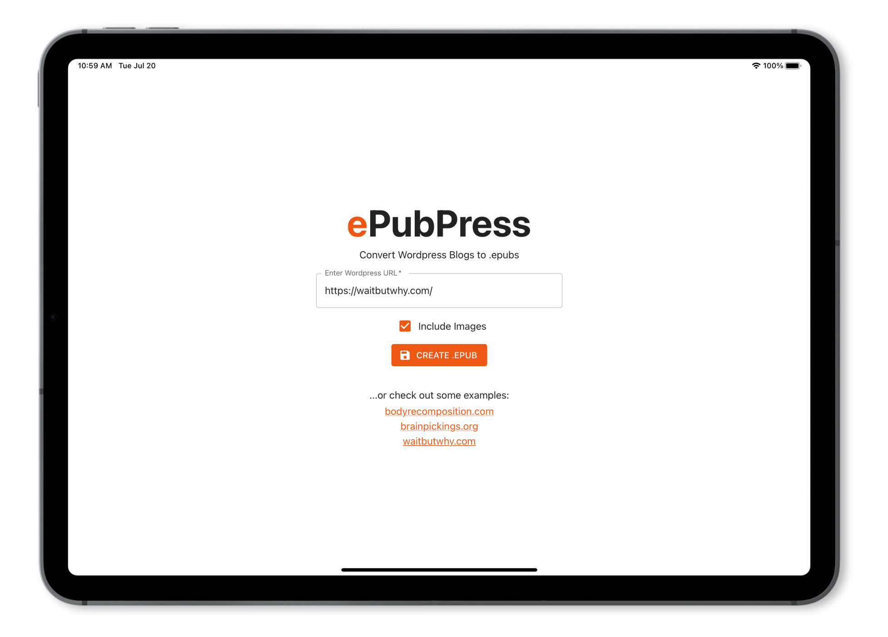
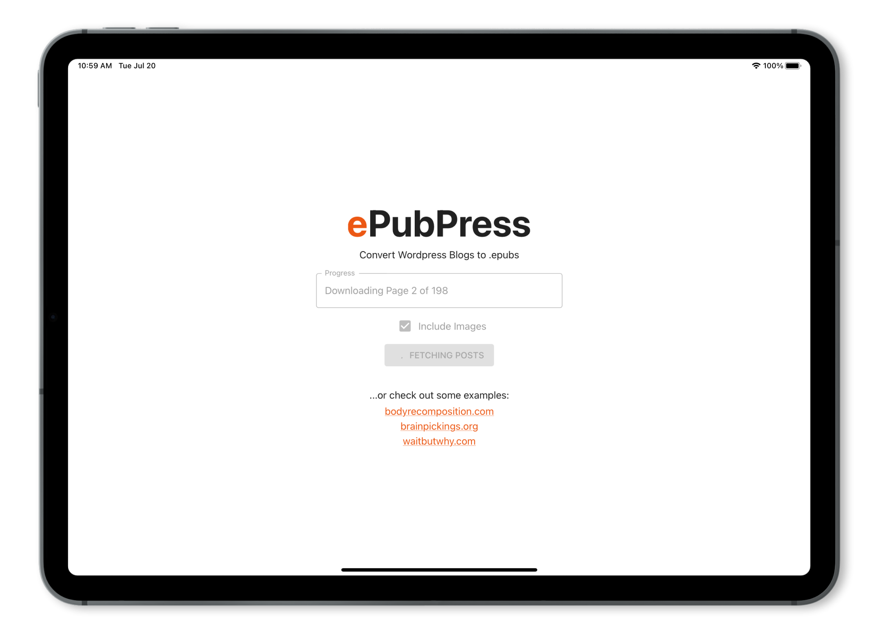
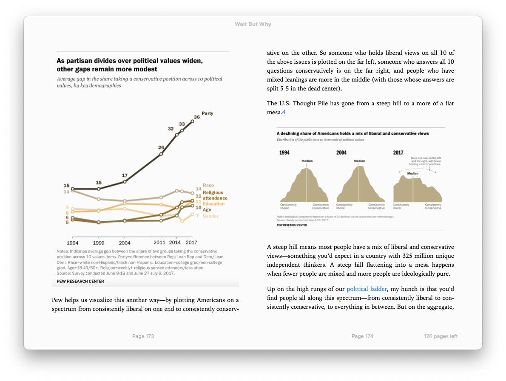

## The Problem

There are a lot of blogs with high quality content — sadly, the reading experience often doesn’t do their creators justice.

While there are methods abound for making single posts and articles more readable, doing so for the whole site is a different matter.

## The Solution

Create a web app that allows one to enter a Wordpress URL, and be returned an ebook for a more convenient reading experience.

## Outcome

**ePubPress** is a web app that allows you to enter an URL to a Wordpress site and get back a fully-fledged ebook, with each chapter corresponding to a post.

This way, you can archive your favorite blogs, and indulge all at once in any new gem you fund — even offline.

Get the full advantage of the tools ebook readers come with, including the highlighting of text passages, bookmarking positions, and adding notes.

<figure>
  
  <figcaption>Enter an URL to a Wordpress(.com) blog...</figcaption>
</figure>

<figure>
  
  <figcaption>...observe the progress bar..</figcaption>
</figure>

<figure>
  
  <figcaption>...enjoy reading!</figcaption>
</figure>

### Built With

- [React.js](https://reactjs.org/)
- [Material UI](https://mui.com/)
- [Wordpress API](https://developer.wordpress.org/rest-api/)
- [Netlify](https://netlify.com)

## Getting Started

1. `npm install netlify-cli -g`
2. `netlify dev`

## License

Distributed under the MIT License. See `LICENSE.txt` for more information.

## Background

There are a lot of blogs out there, with a wide range of quality. Some of them might as well be sold as books, so good and consistent is their quality. To me, [waitbutwhy.com](https://waitbutwhy.com/) and [bodyrecomposition.com](https://bodyrecomposition.com/) are such examples.

While their content differs, the quality in their respective fields doesn’t: waitbutwhy explore scientific concepts and ideas in a humorous, and memorable manner, teaching valuable information effortlessly.

Bodyrecomposition meanwhile is one of the greatest treasure troves when it comes to evidence based training and nutrition information.

As such, the high standard to which these blogs are held by their authors makes each article a chapter in a book whose writing is ongoing - which is the way I wanted to consume them in.

Back in the day I used to create small applications that used to loop through a blog’s RSS feed and feed them into Evernote. Later on, I decided to bundle them up into a much more convenient ebook format, which involved a lot of manual labour.

At the time, this approach served its purpose, allowing me to binge read and annotate to my liking. Recently though, I thought of revisiting this idea, with my backlog of unread material adding up and Wordpress nowadays having a fully working REST API, which simplifies the process a lot.

## How It Works

The application asks the user for a Wordpress URL. A little background check is run on the chosen site, querying its source for evidence of Wordpress related code.

On success, a request is sent to the API, looping through the posts and binding them into a book. (Wordpress.com sites have slightly different endpoints, but otherwise act the same.)

Ticking the “Include Images” box fetches each image on each post, creates a blob and attaches it as a local reference in place of the original link. Naturally, this lengthens the process quite a bit, which is why I decided to include a progress indicator, as to not give off the impression of an unresponsive program.

Where available, other information gathered through the API is used to populate the .epub’s metadata field, such as the site author, categories and publisher.
